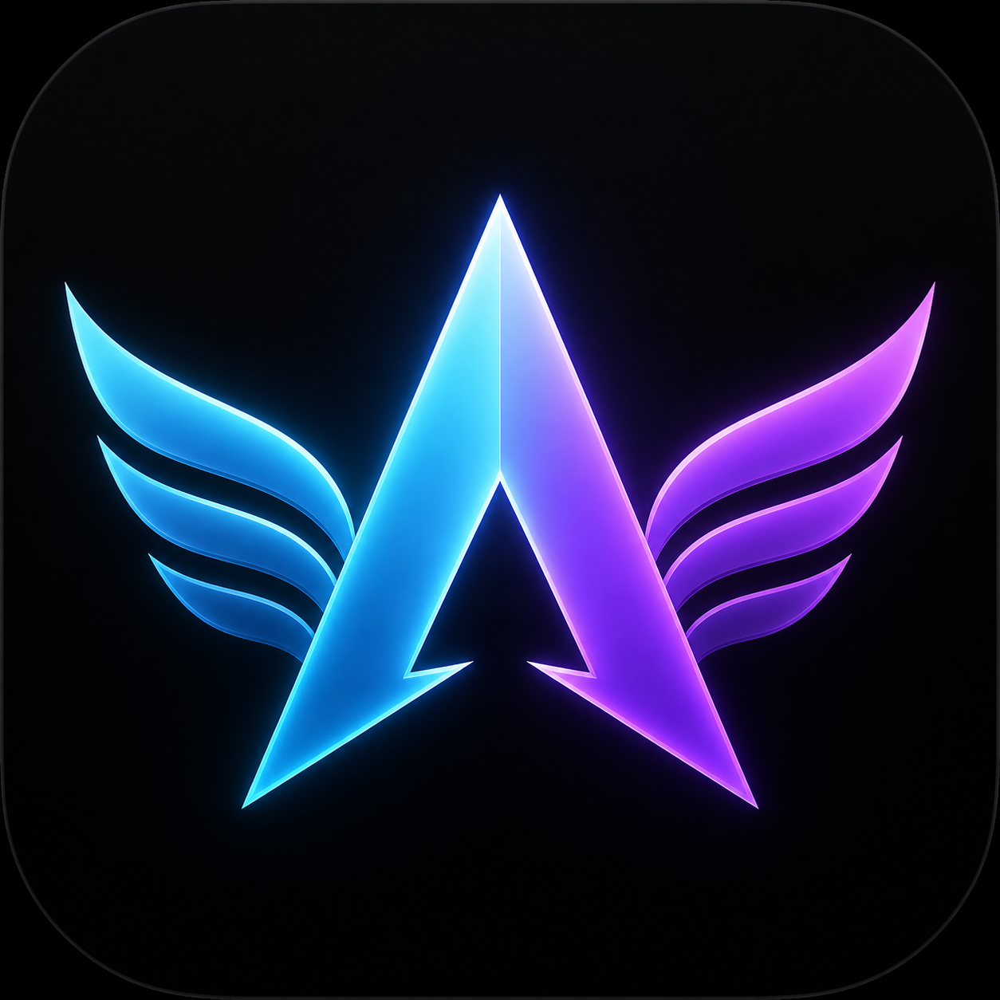

<p align="center">
  
</p>

# AirControl

AirControl 是一个原生 macOS 摄像头手势与视线辅助控制应用：在用户明确开启后，它用系统 Vision 框架提取双手及眼部关键点，再由 Rust 共享核心把输入转换为光标移动、左右键、双击、拖拽、滚动和暂停命令。

应用只在本机内存中处理当前摄像头帧，不录制、不保存、不上传画面，也不申请麦克风、屏幕录制、输入监控或网络权限。

## 当前能力

- 食指移动光标；手掌横放或旋转时仍按关节形状识别。平滑按真实时间计算，摄像头帧率变化时手感不会忽快忽慢，并支持两点活动范围校准和平滑度调整。
- 拇指与食指短捏为左键单击，持续捏合为拖拽；从开始捏合到确认点击期间光标锁定在捏合前的位置，避免收拢食指带偏点击。
- 拇指与中指短捏为右键单击；左右键捏合都允许关节点短暂遮挡，并用连续张开样本防止误松开。
- 食指和中指伸出并上下移动为滚动。
- 可选的“视线辅助”通过九点校准将普通摄像头识别到的瞳孔相对位置映射到目标显示器：双手离开画面时用视线粗定位，右手进入后从当前光标位置相对微调。它默认关闭、不使用眨眼点击；闭眼、丢脸或置信度不足时冻结光标。
- 控制中开始九点校准会先安全释放所有鼠标状态；成功且权限仍有效后自动重连摄像头并恢复控制。取消、模型无效、处理失败或权限失效不会误启动。
- 可选的“屏幕辅助光源”在目标显示器边缘显示不抢焦点的柔光，可调亮度与冷暖色并在重启后恢复。它默认关闭；未打开开关时，启动、九点校准和控制恢复都不会显示柔光。它不读取屏幕、不新增权限，也不能关闭系统摄像头绿色隐私灯。
- 右手稳定张开后，在 0.65 秒内完成收拢并连续两帧握拳，可从当前光标所在的任意窗口区域“抓住”窗口；移动右手掌心即可移动窗口，重新张掌释放。单独把拳头放进画面不会触发。
- 伸出左手可启用六种辅助模式：张开手掌为 40% 精细稳定移动；仅伸食指锁定光标；竖拇指让右手短捏变成双击；V 手势让右掌移动变成滚动；伸三指进入安全拖拽；稳定握拳暂停或恢复。右手握拳不会再误触暂停。
- 左手辅助姿势需要稳定至少 0.12 秒且连续出现两帧；短暂遮挡 0.20 秒内保持当前模式，超时会安全退出并释放拖拽。
- `Control + Option + Command + A` 可随时紧急停止或重新开启。
- 可选择摄像头和目标显示器并在下次启动时恢复；已保存设备不存在时回退到系统首选摄像头或主显示器。摄像头中断、目标显示器断开、权限丢失、丢手、识别连续失败、退出应用时都会安全释放鼠标按键。Vision 连续失败会暂停投递但保持摄像头运行，连续两帧恢复后自动继续；真正的摄像头错误可通过停止后再次开启重建会话。
- 移动、左键、拖拽、右键和滚动可分别关闭；握拳暂停始终保留为安全能力。
- 摄像头偶发给出越界、低置信度或非有限的单个关节点时，该点按暂时缺失处理；每种手势只依赖自身需要的关节点，无关手指丢点不会打断食指移动。真正的处理错误会在主窗口显示具体原因。

## 架构

处理链路为：macOS 摄像头 → Vision 手部/眼部关键点 → C 兼容接口 → Rust 手势与视线状态机 → 抽象鼠标命令 → macOS 系统事件。

`crates/aircontrol-core` 是平台无关业务规则的唯一实现，负责关键点置信度、手势时序、视线九点校准、视线映射与平滑、视线到右手的无跳动接管、坐标映射、设置校验和安全释放。Swift 只负责 macOS 摄像头、Vision 原始关键点、系统权限、鼠标/窗口操作、数值模型持久化和界面。未来 Windows/Linux 版本应复用 Rust crate 和 `include/aircontrol_core.h`，只为各自系统实现摄像头检测与系统事件外壳，不复制业务规则。

## 开发环境

- macOS 14 或更高版本
- Xcode（支持 Swift 6）
- Rust 稳定工具链
- XcodeGen

若尚未安装 XcodeGen，可通过 Homebrew 安装：

```bash
brew install xcodegen
```

## 构建与运行

```bash
cd AirControl
xcodegen generate
open AirControl.xcodeproj
```

在 Xcode 中选择 `AirControl` scheme 和 `My Mac` 后运行。首次启动时：

1. 允许摄像头权限。
2. 按界面提示前往“系统设置 → 隐私与安全性 → 辅助功能”，允许 AirControl 控制电脑。
3. 回到应用，选择摄像头和目标显示器；建议先完成两点校准。
4. 如需改善面部照明，开启“屏幕辅助光源”并调整亮度与冷暖色。
5. 如需视线粗定位，开启“视线辅助”并依次注视目标显示器上的九个圆点。
6. 点击“开启控制”；若在控制中重新校准，成功后会自动恢复。

Debug 命令行构建：

```bash
xcodebuild build \
  -project AirControl.xcodeproj \
  -scheme AirControl \
  -destination 'platform=macOS,arch=arm64' \
  -derivedDataPath .build/DerivedData \
  CODE_SIGNING_ALLOWED=NO
```

本机日常测试使用固定的本地签名安装，避免每次重建都被 macOS 当成新的应用：

```bash
make signing-check
make signing-test
make install-local
```

默认签名身份为登录钥匙串中的 `AirControl Local Code Signing`，应用标识固定为 `com.liuchong.AirControl`。首次从临时签名迁移后可能需要重新授予一次摄像头和辅助功能。如果辅助功能列表仍保留旧的 AirControl 行且开关开启后应用仍显示“需要授权”，应移除该旧行，再用“添加”选择当前 `/Applications/AirControl.app`；以后使用同一身份覆盖安装时会继承授权。身份缺失、标识不符或签名验证失败时，安装会停止，不会回退到临时签名。此本地自签名只服务当前 Mac 的开发测试，不用于对外分发。

## 测试

```bash
./scripts/verify.sh
```

脚本会检查 Rust 格式与静态分析、运行 Rust 测试、重新生成 Xcode 工程、构建 macOS 应用并运行 Swift 单元测试和跨语言集成测试。真实摄像头与系统授权需要用户在本机确认，手动验收步骤见 [docs/testing.md](docs/testing.md)。

## 安全停止

遇到任何异常时，优先按 `Control + Option + Command + A`，也可以使用菜单栏的停止入口或主窗口按钮。应用退出、摄像头断开和目标显示器消失也会自动调用同一安全停止路径。

## 设计文档

- [长期行为规格](docs/specs/air-control.md)
- [v1 变更设计](docs/changes/aircontrol-v1.md)
- [光标实时控制回归修复](docs/changes/cursor-live-regression.md)
- [光标连续性与捏合可靠性优化](docs/changes/pointer-pinch-quality.md)
- [双手辅助、故障恢复与品牌设计](docs/changes/bimanual-assist-recovery-brand.md)
- [过程性隔空抓窗](docs/changes/process-window-grab.md)
- [本地稳定签名](docs/changes/stable-local-signing.md)
- [普通摄像头视线辅助原型](docs/changes/gaze-assist-prototype.md)
- [视线校准恢复与屏幕辅助光源](docs/changes/gaze-resume-fill-light.md)
- [验证与手动验收](docs/testing.md)

本仓库没有面向用户的命令行程序，因此不存在 `/help` 或 `--help`；应用内“手势与安全说明”和本 README 提供相同帮助信息。
